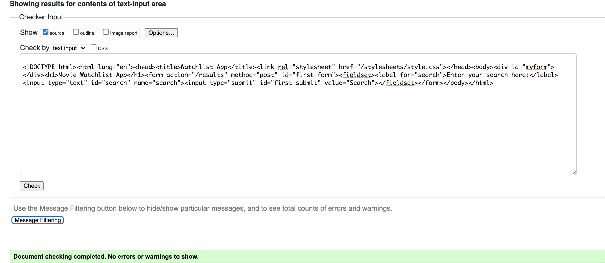
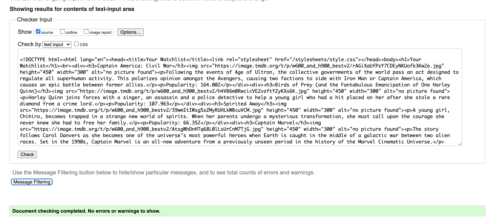

[]
# Movie Watchlist Application

A simple application that allows you to add movies to your watchlist.

## Link to App + Demo

[Go here](https://catherid-moviewatchlist.herokuapp.com/) and type in your desired search query. Once there, mark any movies you're interested in by selecting the checkbox next to it. Once you're done, hit the `add to watchlist` button. [Navigate here](https://catherid-moviewatchlist.herokuapp.com/watchlist) to see your added movies!

[Link to demo](https://drive.google.com/file/d/1sKl5a72BRkOTlfyXuHndXcWa0xVbwr2_/view?usp=sharing)

## Description

This application allows users to search for movies and save ones they like to a watch list. It is intended to help a user keep track of all the movies they may be interested in eventually viewing, but don’t have time to at the moment. Often, people express interest in watching something that they heard on the news or from a friend, but because they don’t write it down or store it somewhere, they will forget about it. This application solves this pain point by compiling a user’s movies in a single watchlist that they can view and add to at any time. 

## Client side + server side

The client side part of the application is what the user sees. This includes the UI of the search page, the results page, and the watchlist page. They can type queries into the search bar, view the results fetched by the API, and see their updated watchlist.

The server side part of the application occurs when the user presses the search button / hits enter. This calls an API query, which will return a JSON of results. The application processes the results to be read in an aesthetically pleasing way for the user to see. When a user chooses which movie(s) to add to a watchlist, the application checks which checkboxes are checked and adds those movie(s) to the MongoDB database.

## API Use

This project utilizes the TMDB (The Movie Database) API. When the user types a search query, the TMDB API will return a JSON doc of results. According to the official TMDB documentation, the API stores a movie’s MPAA rating, budget, genre(s), original language, original title, overview, popularity, poster URL, production companies, production countries, release date, revenue, runtime, spoken languages, production/release status, tagline, title, vote average, and vote count. For the scope of this project (and for easier navigation of the user) I chose to display the original title, the poster, the overview (official summary), and the popularity (a score generated by TMDB). 

## MVC

Models:
When the user performs the search query, the TMDB API returns the results as a JSON document. I parsed the JSON and extracted the relevant data. Additionally, any movies the user saves will be added to the MongoDB model. The functionloops through the MongoDB database and formats it properly so it can be rendered by the get route (see Controllers). 

Views:
The view consists of a home page, in dark mode with a 4:5:1 color contrast for accessibility. There is a search bar that the user can type keywords into. Next to the search bar is a button they can click to retrieve the results. Three movies are displayed per row, with the poster at the top and title, overview, and popularity below the image. Next to each result is a checkbox the user can mark. A separate watchlist page displays the content in the MongoDB collection, in the same format as the search results.

Controllers:
There is one post route for when the search button is clicked. The controller will pass the search query via string formatting to the API call. The router will render the results, as described in the view. There is another post route for when a checkbox is clicked. The router saves that movie into the database. Lastly, there are get routes to display the user’s updated watchlist and the home page. 

## Cookie Storage

When the user selects movie(s) to add to their watchlist, the session will store the movie results they chose as cookies. The cookies will be displayed to the user. It says "You just saved...." and lists the respective movie(s).

## Database

The MongoDB Atlas stores the movie results from the TMDB API. When the user checks the corresponding checkbox for a movie and clicks the `Add to Watchlist` button, the movie's title, image URL, overview and popularity will be automatically saved in MongoDB. Then, in the watchlist page, the controller loops through the MongoDB and displays all the attribuutes that were saved. I am not validating or sanitizing the data because the user does not have the ability to input or change data. The data in MongoDB is coming from the API, which has already been validated and sanitized by TMDB.

## HTML Validator

Home page:

Watchlist page:

